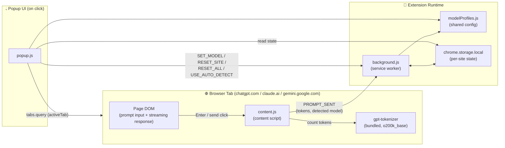

# AquaTrace — System Architecture

This document describes how AquaTrace's pieces fit together. For feature docs and setup instructions, see [README.md](./README.md). For the water/energy/CO2 calculation methodology, see [methodology.html](./methodology.html).

## High-level architecture

## Components

| Component | Role |
|---|---|
| **`content.js`** (content script) | Injected into supported AI chat pages only. Detects when a prompt is submitted and when a response finishes streaming, counts tokens for both using the bundled tokenizer, scans the page for the currently-selected model name, and sends the result to the background script. Never sends the actual conversation text anywhere — only token counts. |
| **`background.js`** (service worker) | The only long-lived piece. Owns all persisted state in `chrome.storage.local`, keyed per site. Applies auto-detected models unless the user has manually overridden that site's choice. Handles reset requests. |
| **`popup.js`** (popup UI) | Runs only while the popup is open. Determines which site's card to show by querying the active tab, reads state from storage, and renders it. Sends messages to the background script for any state changes (model picks, resets) rather than writing storage directly. |
| **`modelProfiles.js`** (shared config) | Not a running component — a shared data module imported by `content.js`, `background.js`, and `popup.js` alike, so all three always agree on model energy values, per-company water efficiency ranges, and model-detection keyword patterns. |
| **`chrome.storage.local`** | The only persistence layer. Never synced, never transmitted — local to the browser profile. |

## Why this shape

- **Content script never talks to storage directly.** It only ever sends a message to the background script, which is the single source of truth for state. This avoids race conditions if multiple tabs on the same site are open at once.
- **Popup never runs in the background.** It only exists while open, so it always re-derives "which site am I looking at" fresh from `chrome.tabs.query` rather than trying to stay in sync with a background process.
- **Shared config, not duplicated constants.** Because `modelProfiles.js` is imported by all three surfaces, an update to a model's energy estimate or detection pattern only needs to happen in one place.

## Data flow for a single prompt (end to end)

1. User types in the chat page and hits Enter.
2. `content.js` captures the prompt text, tokenizes it, and starts watching the page for the response.
3. Once the page goes quiet for 1.5s, `content.js` tokenizes the response text and scans the page for the active model's name.
4. `content.js` sends `PROMPT_SENT` (site, promptTokens, responseTokens, detectedModelId) to `background.js`.
5. `background.js` updates that site's entry in `chrome.storage.local` — incrementing counts, and updating the model only if the user hasn't manually overridden it.
6. Next time the popup is opened, `popup.js` reads that entry, applies the current model's Wh/token and the hosting company's WUE range, and renders the result.
